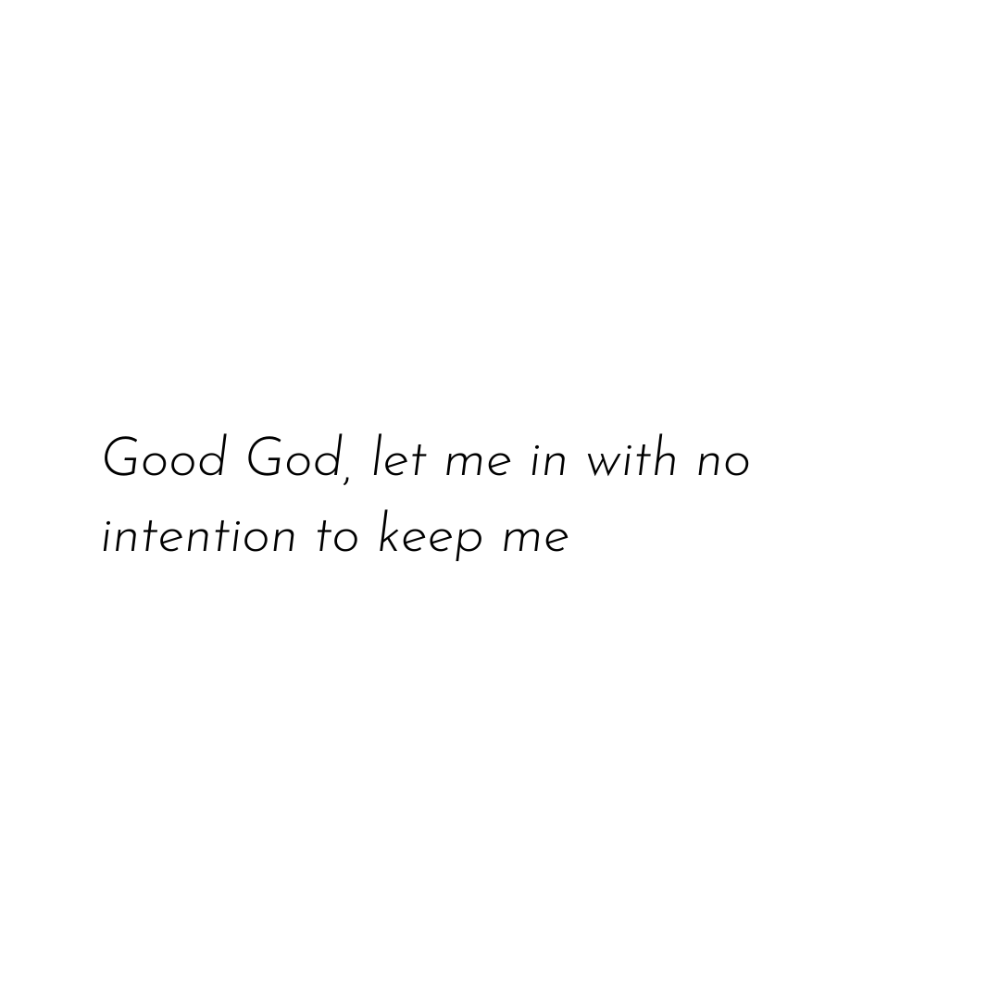

# Lyrics Generation : An NLP project
What if we had the ability to predict new lyrics of your favourite artists in their style?  
Turns out, we can - with the help of Machine Learning.

## Gathering the lyrics
Since I wanted to allow choosing any artist to predict their lyrics, I had to write a program to web scrape the lyrics of ALL songs through lyric websites. Using BeautifulSoup and python, I scraped the lyrics from websites and stored them in a pickle file. This file is the "corpus", i.e, the dataset on which I will train and test the model.

## Markov Chain
Markov chain is a concept that uses graph theory. At each node is a state - which in this case is a single word. There are connections to different states that control how the states will interact with each other.  
In this particular project, I have used a bigram chain, just to ease the complexity. However, using a Markov Chain causes a certain amount of repetition (especially with a bigram model) but its still fun, and there isnt a need to do too deep into ML or NLP. Lyrics prediction can also be done using LSTM or other Recurrent Neural Networks.

## Results
My favourite artist is Hozier, and he also hasn't released any new music. So naturally, I tested this with his style, and the lyrics came out pretty good:  

